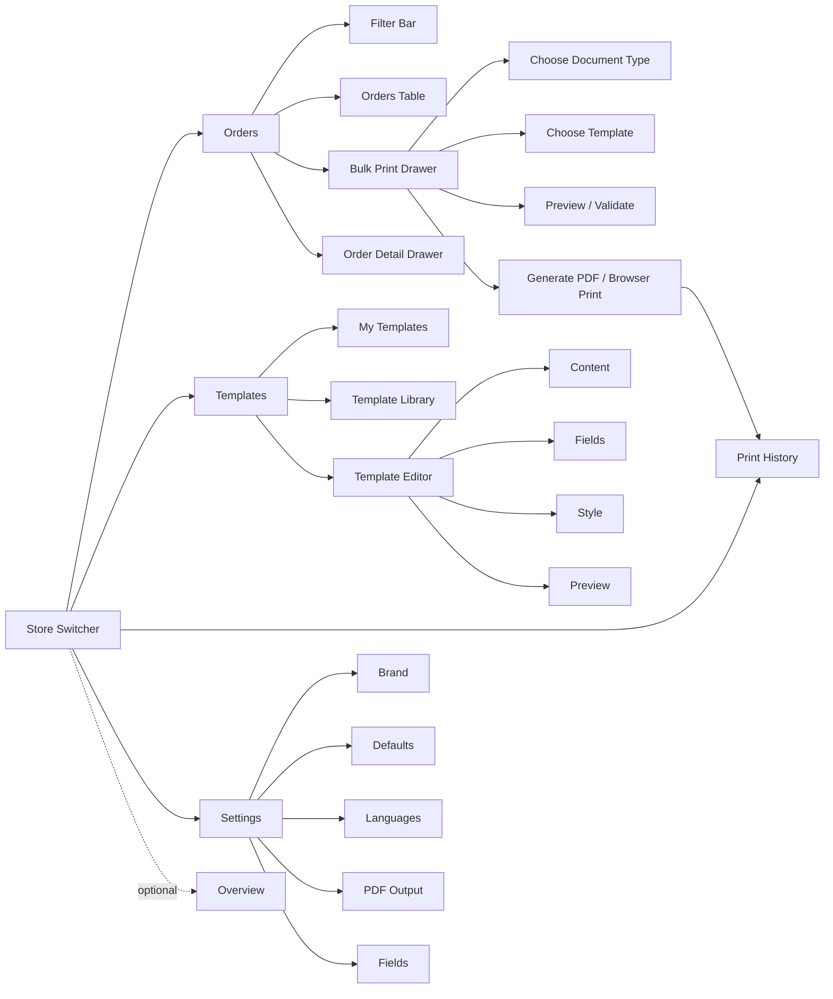

# Zider PrintOps 系统结构文档

版本：v0.4
更新日期：2026-05-26
文档类型：页面结构与菜单结构
当前范围：Wix Stores 首发，优先覆盖订单模板、字段映射、自定义样式、预览、PDF、浏览器打印和打印记录

## 1. 结构原则

- 前期只围绕“订单打印”闭环设计，不把发货平台、打印机连接、云打印、本地代理放进主流程。
- 系统不单独维护复杂“订单类型”，用“模板场景 + 匹配规则 + 手动选择模板”处理。
- 模板编辑器按组件化数据结构设计，P0 不做复杂拖拽，但为后续拖拽和组件库预留。
- 支持多店铺概念。一个商家组织可以连接多个店铺，订单、模板、字段映射和默认设置都需要按店铺隔离或覆盖。
- 页面以工作台效率为主，优先表格、筛选、预览、批量操作和状态反馈。
- 所有主操作都应能回到订单、模板、打印记录三个核心对象。
- 界面默认围绕“选择订单 -> 选择模板 -> 预览校验 -> 生成 PDF / 浏览器打印 -> 记录 print job”的闭环展开。
- Invoice Helper、Receipt Helper 是订单凭证辅助入口，不把产品界面包装成合规税务发票系统。
- 产品字段、自动邮件、发货回写、客户下载链接等能力先在信息架构中预留，不提前进入 P0 主流程。
- P0 默认入口优先进入 Orders，而不是 Overview。Overview 可保留为轻量工作台，但不阻断用户打印路径。
- 面向用户的菜单命名要产品化：`Print Jobs` 对外显示为 `Print History`，`Field Mapping` 对外显示为 `Fields`，模板页使用 `My Templates` 和 `Template Library`。
- 设计语言参考 CRM / SaaS 工作台：支持侧边栏收起、Light / Dark 主题、表格 + 预览并列；多语言阅读方向前期只做模型预留。详见 `order-printing-design-language.md`。

## 2. 信息架构

核心对象：

| 对象 | 说明 | 主要页面 |
|---|---|---|
| Store | 当前连接的 Wix 店铺 | Settings |
| Organization | 商家组织，可包含多个店铺 | Settings |
| Store Location | 店铺下的门店 / 自提点 / 业务地点 | Settings |
| Order | 从 Wix 同步的订单 | Orders、Order Detail |
| Product | 从 Wix 同步的产品资料 | Product Fields |
| Product Print Field | 我们系统内维护的产品/变体打印字段 | Product Fields、Template Editor |
| Document Type | 文档类型，如 Packing Slip、Invoice Helper | Templates、Template Editor |
| Built-in Template | 系统内置模板，商家可复制后使用 | Templates |
| Template | 可配置的打印模板 | Templates、Template Editor |
| Template Component | 模板里的 section / block / field component | Template Editor |
| Field | Wix 字段到标准字段或模板字段的映射 | Fields、Template Editor |
| Document Output | 生成的 PDF、浏览器打印输出、ZIP 文件 | Print History |
| Print Job | PDF 生成、下载、浏览器打印记录 | Print History |

前期不作为主对象：

| 对象 | 处理方式 |
|---|---|
| Printer | 不建主菜单，不做设备连接 |
| Shipment | P3 后续扩展，不进前期页面 |
| Order Type | 不建独立模型，由模板场景和匹配规则承担 |
| Shipping Platform | P3 后续扩展，不进前期页面 |
| Email Automation | P2 / P3 后续扩展，不进前期页面 |
| Customer Download Portal | P2 / P3 后续扩展，不进前期页面 |

## 3. 主菜单结构

### 3.1 P0 主菜单

```text
PrintOps
├── Store Switcher
├── Global Search
├── Workbench
│   ├── Orders
│   ├── Templates
│   └── Print History
└── Setup
    └── Settings
```

P0 二级结构：

```text
Orders
├── Orders table
├── Bulk print drawer
└── Order detail drawer

Templates
├── My Templates
├── Template Library
└── Template editor

Print History
├── Job history
└── Job detail drawer

Settings
├── Store / brand
├── Defaults
├── Languages
├── PDF output
└── Fields
```

P0 可选入口：

```text
Overview
└── Current store dashboard
```

说明：Overview 可以作为轻量工作台或 `/apps/printops/overview` 页面存在，但 `/apps/printops` 默认应进入 Orders。

### 3.2 P1 菜单扩展

```text
PrintOps
├── Store Switcher
├── Orders
├── Product Fields
├── Templates
├── Fields
├── Print History
└── Settings
```

P1 二级结构：

```text
Product Fields
├── Product list
├── Product detail
├── Product print fields
└── Variant print fields

Templates
├── My Templates
├── Template Library
├── Shared templates
├── Template versions
└── Matching rules

Fields
├── Order fields
├── Line item fields
├── Product fields
└── Missing fields
```

说明：

- P0 可以把 Fields 放在 Settings 或 Template Editor 内。
- 当字段映射成为高频操作后，P1 再以 Fields 独立成主菜单。
- Product Fields 在 P1 独立成菜单；P0 只使用订单行自带商品信息。
- Store Switcher 放在顶部导航或侧栏顶部，不作为主菜单项。
- Global Search 放在顶部操作区，不作为主菜单项。
- 侧边栏菜单按 `Workbench` 和 `Setup` 分组，支持展开 / 收起和当前菜单高亮。
- 不设置 Printers 菜单。
- 不设置 Shipments 菜单。
- 不设置 Order Types 菜单。
- 不设置 Invoices 独立菜单。Invoice Helper、Receipt Helper 都归在 Templates 和 Orders 批量打印流程里。
- 不设置 Products P0 主菜单。P0 的产品信息只在订单行和模板预览中展示；P1 用户侧菜单命名为 Product Fields，避免误解为商品管理系统。

### 3.3 P0 界面结构图



### 3.4 Store Switcher

用途：切换当前操作上下文。

显示内容：

- 当前组织名称。
- 当前店铺名称。
- 店铺平台，如 Wix。
- 店铺同步状态。

操作：

- 切换店铺。
- 查看全部店铺。
- 进入 Settings / Stores。
- 连接新店铺。

切换影响：

- Orders 只显示当前店铺订单。
- Templates 默认显示当前店铺的 My Templates，同时可查看共享模板。
- Print History 只显示当前店铺任务。
- Settings 默认进入当前店铺设置。
- Overview 显示当前店铺指标，P1 可增加 all stores 总览。

## 4. 路由结构

### 4.1 P0 路由

```text
/apps/printops                # 默认进入 Orders
/apps/printops/overview       # optional
/apps/printops/stores/:storeId
/apps/printops/orders
/apps/printops/orders/:orderId
/apps/printops/templates
/apps/printops/templates/library
/apps/printops/templates/library/:libraryTemplateId
/apps/printops/templates/new
/apps/printops/templates/:templateId
/apps/printops/print-history
/apps/printops/settings
/apps/printops/settings/fields
```

### 4.2 P1 路由

```text
/apps/printops/fields
/apps/printops/product-fields
/apps/printops/product-fields/:productId
/apps/printops/templates/shared
/apps/printops/templates/:templateId/rules
/apps/printops/templates/:templateId/versions
/apps/printops/templates/:templateId/preview
```

### 4.3 P2 / P3 预留路由

```text
/apps/printops/integrations/woocommerce
/apps/printops/templates/packs
/apps/printops/integrations/shopify
/apps/printops/integrations/shipping
```

预留路由不进入前期导航，只在后续阶段开放。

## 5. 页面结构

### 5.1 Overview

用途：快速查看订单打印工作状态。

路径：

```text
/apps/printops/overview
```

说明：P0 中 `/apps/printops` 默认进入 Orders。Overview 是轻量辅助页面，不作为第一打印路径。

页面模块：

| 模块 | 内容 |
|---|---|
| Summary Metrics | 今日订单数、未打印订单数、待校验订单数、PDF 生成数、失败任务数 |
| Print Queue | 当前店铺待打印订单、最近待处理模板、异常订单 |
| Quick Actions | Print unprinted orders、Create from template library、Review missing fields |
| Recent Print History | 最近打印任务、状态、下载入口 |
| Template Shortcuts | Packing Slip、Pick List、Production Sheet、Invoice Helper、Receipt Helper、Thermal Receipt |
| Alerts | 字段缺失、同步失败、模板未配置、PDF 生成失败提醒 |

P0 操作：

- 切换当前店铺。
- 进入 Orders。
- 进入 Templates。
- 从内置模板创建模板。
- 下载最近 PDF。
- 查看失败 print job。

多店铺规则：

- P0 Overview 默认显示当前店铺数据。
- P1 可增加 `All stores` 视图，显示所有店铺汇总。
- 当前店铺无订单时，引导同步当前店铺订单。

### 5.2 Orders

用途：订单筛选、批量选择、预览和打印。

路径：

```text
/apps/printops/orders
```

页面结构：

```text
Orders
├── Header
│   ├── Page title
│   ├── Current store
│   ├── Sync status
│   └── Refresh orders
├── Filter bar
│   ├── Search
│   ├── Date range
│   ├── Payment status
│   ├── Fulfillment status
│   ├── Print status
│   ├── Document type
│   └── Template scenario
├── Orders table
├── Bulk action bar
├── Bulk print drawer
└── Order detail drawer
```

订单表格字段：

| 字段 | P0 |
|---|---|
| Checkbox | 是 |
| Order number | 是 |
| Customer | 是 |
| Order date | 是 |
| Total | 是 |
| Payment status | 是 |
| Fulfillment status | 是 |
| Print status | 是 |
| Last printed at | 是 |
| Document status | 是 |
| Recommended template | 是 |
| Print language | 是 |
| Missing fields warning | 是 |

批量操作：

- Preview。
- Generate PDF。
- Browser print。
- Mark as printed。
- Change template。
- Change print language。

Bulk print drawer：

```text
Bulk Print Drawer
├── Selected orders summary
├── Document type
│   ├── Packing Slip
│   ├── Pick List
│   ├── Production Sheet
│   ├── Invoice Helper
│   ├── Receipt Helper
│   └── Thermal Receipt
├── Template selector
├── Print language selector
├── Paper size selector
├── Validation summary
├── Preview first order
└── Actions
    ├── Generate combined PDF
    ├── Browser print
    └── Mark as printed
```

P1 Bulk print drawer 扩展：

- Generate individual PDFs。
- Download ZIP。
- Apply custom file naming rule。
- Split by template / language。
- Reprint selected orders。

多店铺规则：

- Orders P0 只显示当前店铺订单。
- 订单不能跨店铺批量打印。
- 切换店铺后保留通用筛选项，但清空已选订单。
- Print status 按店铺隔离。

订单详情抽屉：

| 区域 | 内容 |
|---|---|
| Summary | 订单号、客户、金额、状态 |
| Customer | 姓名、邮箱、电话、公司、税号 |
| Addresses | Shipping、Billing、Pickup、Delivery |
| Line Items | 商品、SKU、variant、数量、图片、自定义字段 |
| Product Fields | 产品打印字段、变体打印字段、合并来源 |
| Notes | Buyer note、gift note、internal note |
| Custom Fields | 字段 key、label、value、映射状态 |
| Document Outputs | 可生成的文档类型、推荐模板、最近输出文件 |
| Print History | 已生成 PDF、已打印、失败记录 |
| Actions | Preview、Generate PDF、Mark as printed、Refresh order |

### 5.3 Order Detail

用途：查看单个订单完整信息和打印历史。

路径：

```text
/apps/printops/orders/:orderId
```

说明：

- P0 可先用 drawer 实现，不一定需要独立页面。
- 如果订单字段和打印历史较复杂，P1 再开放独立详情页。

页面模块：

- Order summary。
- Customer and address。
- Line items。
- Product print fields。
- Custom fields。
- Recommended templates。
- Print preview entry。
- Print job history。

### 5.4 Templates / Template Center

用途：管理打印模板，承接模板发现、创建、预览、默认模板和进入编辑器。

路径：

```text
/apps/printops/templates
/apps/printops/templates/library
/apps/printops/templates/library/:libraryTemplateId
```

页面结构：

```text
Template Center
├── Header
│   ├── Current store
│   ├── Page title
│   ├── Search
│   └── Create template
├── Tabs
│   ├── My Templates
│   ├── Template Library
│   └── Shared templates (P1)
├── Template filters
├── Main content
│   ├── Template list / cards
│   └── Library cards
├── Right detail panel
│   ├── Template summary
│   ├── Preview thumbnail
│   ├── Validation summary
│   └── Primary actions
└── Empty / loading / error states
```

P0 默认交互：

- 进入 `/apps/printops/templates` 默认显示 `My Templates`。
- `My Templates` 只显示当前店铺模板。
- `Template Library` 展示系统内置模板，内置模板不能直接编辑。
- 点击店铺模板卡片后，右侧展示详情和预览入口。
- 点击内置模板卡片后，右侧展示样例预览和 `Use this template`。
- `Create template` 默认打开从内置模板创建的流程。
- 从内置模板创建成功后，生成当前店铺模板，并可进入 Template Editor。
- 切换店铺后，清空搜索、筛选和右侧详情选择。

Template Library 分类：

| 分类 | 内置模板 |
|---|---|
| Fulfillment | Packing Slip、Pick List、Delivery Note |
| Production | Production Sheet、Internal Order Print |
| Customer Documents | Receipt Helper、Gift Receipt、Return Form |
| B2B Helper | Invoice Helper、Quote Helper、Credit Note Helper |
| Store / POS | Thermal Receipt、Pickup Slip |

P0 内置模板：

- Packing Slip。
- Pick List。
- Production Sheet。
- Invoice Helper。
- Receipt Helper。
- Thermal Receipt。

P1 / P2 扩展模板：

- Gift Receipt。
- Return Form。
- Delivery Note。
- Quote Helper。
- Credit Note Helper。
- 行业模板包。

模板列表字段：

| 字段 | 说明 |
|---|---|
| Template name | 模板名称 |
| Description | 模板说明 |
| Document type | Packing Slip、Production Sheet、Thermal Receipt 等 |
| Paper size | A4、Letter、4x6、80mm |
| Default language | 默认打印语言 |
| Default font | 默认字体预设 |
| Scenario | 模板场景 |
| Scope | 当前店铺模板或组织共享模板 |
| Source | Built-in、Store、Shared、Imported |
| Status | P0 使用 Draft、Ready；P1 增加 Inactive |
| Default badge | 是否为当前文档类型默认模板 |
| Validation | 缺字段、图片异常、分页溢出等摘要 |
| Last updated | 最近更新时间 |

模板操作：

- Edit。
- Duplicate。
- Preview。
- Create from template library。
- Set as default。
- Delete。
- Use this template。
- Rename。

P1 操作：

- Share to organization。
- Copy to current store。
- Disable。
- View versions。
- Configure matching rules。

P0 空状态：

| 状态 | 页面表现 |
|---|---|
| 当前店铺没有模板 | 显示 Template Library 推荐模板和 Create from library |
| 搜索无结果 | 提供 Clear filters 和 Browse library |
| 模板校验失败 | 卡片显示 warning，详情列出缺失字段，禁止设为默认 |
| 内置模板复制失败 | 保留创建弹窗输入，提示失败原因 |
| 加载失败 | 提供重试和返回 Orders |

多店铺规则：

- P0 模板默认归属当前店铺。
- P1 支持组织共享模板。
- 共享模板可复制到具体店铺后单独修改。
- 店铺默认模板优先于组织默认模板。
- P0 删除默认模板前必须先指定新的默认模板，或恢复系统 fallback。
- 预览订单只能从当前店铺选择。

### 5.5 Template Editor

用途：编辑模板字段、样式、文案和预览。

路径：

```text
/apps/printops/templates/new
/apps/printops/templates/:templateId
```

页面结构：

```text
Template Editor
├── Top bar
│   ├── Template name
│   ├── Template scope
│   ├── Document type
│   ├── Paper size
│   ├── Preview order selector
│   ├── Save
│   └── Preview / Generate PDF
├── Left panel
│   ├── Sections
│   ├── Blocks
│   ├── Fields
│   └── Components
├── Center canvas
│   └── Print preview
└── Right panel
    ├── Document
    ├── Content
    ├── Style
    ├── Visibility
    └── Field binding
```

右侧属性面板分组：

| 分组 | 内容 |
|---|---|
| Document | 文档类型、纸张尺寸、默认语言、默认字体 |
| Content | 标题、固定文案、页眉页脚、政策说明 |
| Fields | 字段开关、字段 label、商品表格列、custom fields |
| Style | 字体、字号、颜色、对齐、间距、图片大小 |
| Visibility | 价格显示、图片显示、空字段隐藏、内部字段显示 |
| Binding | 绑定标准字段、自定义字段、产品打印字段 |

P0 编辑能力：

- 选择文档类型。
- 选择纸张尺寸。
- 设置默认打印语言。
- 设置默认字体。
- 配置 logo、店铺名称、店铺地址。
- 开关字段显示。
- 调整字段排序。
- 自定义字段 label。
- 配置商品表格列显示和排序。
- 配置基础样式：字体、字号、粗细、颜色、对齐。
- 编辑页眉、页脚、固定文案。
- 编辑感谢语、退换货说明、客服联系方式。
- 设置商品图片显示。
- 设置价格显示。
- 选择预览订单。
- 查看分页和溢出提示。

P0 不做：

- 自由拖拽定位。
- 任意 CSS 编辑。
- 任意 HTML 编辑。
- 复杂画布设计工具。
- 合规电子发票配置。
- 自动邮件发送配置。

技术结构要求：

- 模板保存为结构化 JSON。
- 左侧 section / block / field 操作应对应模板 JSON。
- 中间预览由模板 JSON 渲染。
- 右侧属性面板只修改受控 schema。
- 即使 P0 只是表单式配置，也要使用组件模型保存。

多店铺规则：

- 模板可绑定当前店铺品牌信息。
- 共享模板应使用变量引用品牌信息，如 `store.logo`、`store.name`、`store.address`。
- 预览订单只能选择当前店铺订单。
- 复制模板到其他店铺时，需要提示字段映射和品牌变量是否可用。

### 5.6 Product Fields

用途：同步产品资料，维护产品级和变体级打印字段。

路径：

```text
/apps/printops/product-fields
/apps/printops/product-fields/:productId
```

阶段：

- P0：不独立做 Product Fields 页面，只使用订单行自带商品信息。
- P1：独立为 Product Fields 菜单。

页面结构：

```text
Product Fields
├── Header
│   ├── Current store
│   ├── Sync status
│   └── Sync products
├── Filter bar
│   ├── Search
│   ├── SKU
│   ├── Product status
│   └── Missing print fields
├── Product fields table
└── Product detail drawer / page
```

产品列表字段：

| 字段 | 说明 |
|---|---|
| Product image | 商品图片 |
| Product name | 商品名称 |
| SKU | 默认 SKU |
| Variants | 变体数量 |
| Print fields | 产品打印字段数量 |
| Missing fields | 缺失字段提示 |
| Sync status | 同步状态 |
| Updated at | 更新时间 |

产品详情模块：

| 模块 | 内容 |
|---|---|
| Product summary | 图片、名称、SKU、平台商品 ID |
| Variants | 变体、SKU、选项、图片 |
| Wix fields | options、custom text fields、图片等同步字段 |
| Product print fields | 产品级打印字段 |
| Variant print fields | 变体级打印字段 |
| Usage | 被哪些模板使用 |

产品打印字段示例：

- Bin location。
- Production note。
- Packing instruction。
- Material。
- Care instruction。
- Internal SKU。
- Supplier SKU。
- Default production image。
- Product label text。
- HS code / country of origin。

多店铺规则：

- Product Fields 只显示当前店铺产品。
- 产品打印字段按 store 保存。
- P1 支持复制产品打印字段配置到其他店铺。
- 模板引用产品字段时，应使用字段 key，而不是固定产品 ID。

### 5.7 Template Preview

用途：在真实订单数据下检查模板输出。

路径：

```text
/apps/printops/templates/:templateId/preview
```

P0 可作为 Template Editor 内的 preview mode，不一定独立页面。

预览功能：

- 选择预览订单。
- 选择文档类型。
- 选择模板版本。
- 切换打印语言。
- 切换纸张尺寸。
- 显示分页边界。
- 显示字段缺失 warning。
- 显示图片加载 warning。
- 显示文本溢出 warning。
- 显示输出文件名。
- Generate PDF。

### 5.8 Print History

用途：查看 PDF 生成、下载、浏览器打印和失败记录。

路径：

```text
/apps/printops/print-history
```

页面结构：

```text
Print History
├── Header
├── Filters
├── Jobs table
└── Job detail drawer
```

Print history 表格字段：

| 字段 | 说明 |
|---|---|
| Job ID | 打印任务 ID |
| Created at | 创建时间 |
| Created by | 发起人 |
| Orders | 订单数量 |
| Template | 使用模板 |
| Document type | 文档类型 |
| Language | 打印语言 |
| Paper size | 纸张尺寸 |
| Output type | PDF、browser_print、ZIP |
| File name | 文件名 |
| Status | pending、generated、downloaded、printed、failed、review_required |
| Actions | Download、Preview、Mark as printed、Retry |

详情抽屉：

- 订单列表。
- 错误详情。
- 文件链接。
- 输出文件名。
- 任务时间线。
- 重新生成。

P1 扩展：

- ZIP 批次详情。
- 单订单 PDF 列表。
- 自定义文件名规则命中结果。
- Reprint 记录。

### 5.9 Fields

用途：管理平台字段、标准字段和模板字段的映射。

路径：

```text
/apps/printops/fields
```

阶段：

- P0：放在 Settings 或 Template Editor 内，不做独立主菜单。
- P1：独立页面。

页面模块：

| 模块 | 内容 |
|---|---|
| Field Sources | Wix order fields、checkout extra fields、custom fields |
| Product Fields | Wix product fields、variant fields、product print fields |
| Field Samples | 最近订单样本值 |
| Mapping Table | source field、target field、label、type、scope |
| Missing Fields | 模板使用但订单缺失的字段 |
| Display Names | 字段显示名称、多语言 label |

P0 界面位置：

- Template Editor / Field binding：为当前模板绑定字段。
- Settings / Fields：管理当前店铺的常用字段映射。
- Order detail drawer / Custom Fields：查看单个订单字段样本和映射状态。

P0 必须展示：

- 字段来源。
- 字段样本值。
- 字段类型。
- 是否已被当前模板使用。
- 字段缺失时的预览 warning。

操作：

- 创建映射。
- 编辑映射。
- 删除映射。
- 查看样本值。
- 设置字段显示名。
- 标记字段为常用。

### 5.10 Settings

用途：组织、店铺、品牌、默认模板、语言、PDF 和打印偏好设置。

路径：

```text
/apps/printops/settings
```

页面结构：

```text
Settings
├── Organization
├── Stores
├── Current Store
├── Brand
├── Appearance
├── Defaults
├── Languages
├── PDF Output
├── Fields
└── Data sync
```

设置项：

| 分组 | 内容 |
|---|---|
| Organization | 组织名称、成员、默认语言 |
| Stores | 已连接店铺列表、连接新店铺、店铺同步状态 |
| Current Store | 当前店铺名称、平台、店铺 URL、同步状态 |
| Store Locations | 门店、自提点、业务地点、地址、联系方式 |
| Brand | 当前店铺 Logo、品牌色、店铺地址、联系方式 |
| Appearance | Light / Dark 主题、侧边栏默认状态、工作台密度 |
| Defaults | 当前店铺默认模板、默认打印语言、默认纸张尺寸 |
| Languages | 系统语言、打印语言、fallback 语言；阅读方向规则 P1 再开放 |
| PDF Output | 默认文件名规则、分页偏好、图片显示偏好、PDF 合并方式 |
| Fields | 当前店铺字段映射、样本字段、常用字段显示名 |
| Data sync | 手动同步、最近同步时间、同步错误 |

多店铺设置规则：

- 一个 organization 可以拥有多个 stores。
- 每个 store 有独立订单、打印记录、字段映射和默认模板。
- Brand 设置默认按 store 保存。
- Defaults 设置默认按 store 保存。
- P1 支持 organization shared templates。
- P1 支持把模板从一个 store 复制到另一个 store。
- P1 支持 all stores 汇总视图，但批量打印仍按单个 store 执行。

不放入 Settings 的内容：

- 打印机连接。
- 发货平台连接。
- 承运商账户。
- 高级设备协议。

## 6. 菜单权限与状态

### 6.1 空状态

| 页面 | 空状态 |
|---|---|
| Overview | 引导连接 Wix 店铺、选择店铺或同步订单 |
| Orders | 当前店铺暂无订单，提供 Refresh orders |
| Templates | 当前店铺暂无模板，提供 Create from Template Library |
| Print History | 当前店铺暂无打印记录，引导从 Orders 生成 PDF |
| Fields | 暂无字段样本，引导先同步订单 |
| Product Fields | P1 页面，暂无产品时引导 Sync products |
| Settings | 显示基础配置 checklist |

### 6.2 Loading 状态

- 订单同步中。
- 店铺切换中。
- PDF 生成中。
- 模板保存中。
- 预览加载中。
- 字段样本加载中。

### 6.3 Error 状态

- Wix 授权失效。
- 当前店铺授权失效。
- 订单同步失败。
- 图片加载失败。
- 字段缺失。
- PDF 生成失败。
- 模板保存失败。

## 7. P0 页面优先级

P0 必须实现：

1. Store Switcher。
2. Orders。
3. Bulk Print Drawer。
4. Templates。
5. Template Library。
6. Template Editor。
7. Print History。
8. Settings。
9. Overview optional。

说明：

- Orders、Bulk Print Drawer 和 Template Editor 是核心页面。
- 多店铺会影响所有数据查询，Store Switcher 必须早做。
- Template Library 不一定是独立页面，但 Templates 里必须有明确入口。
- Overview 可以先做轻量版本。
- Fields P0 可以内嵌在 Template Editor 和 Settings。
- Order Detail P0 可以先用 drawer。

## 8. 后续预留

P1：

- Product Fields 独立页面。
- Fields 独立页面。
- 模板版本页。
- 模板规则页。
- 模板多语言文案页。
- All stores overview。
- Organization shared templates。

P1.5 / P2：

- Wix Restaurants 模板场景。
- WooCommerce integration setup。
- CSV import mapping。

P3：

- Shopify integration setup。
- Shipping integration setup。
- API keys。
- Agency workspace。
