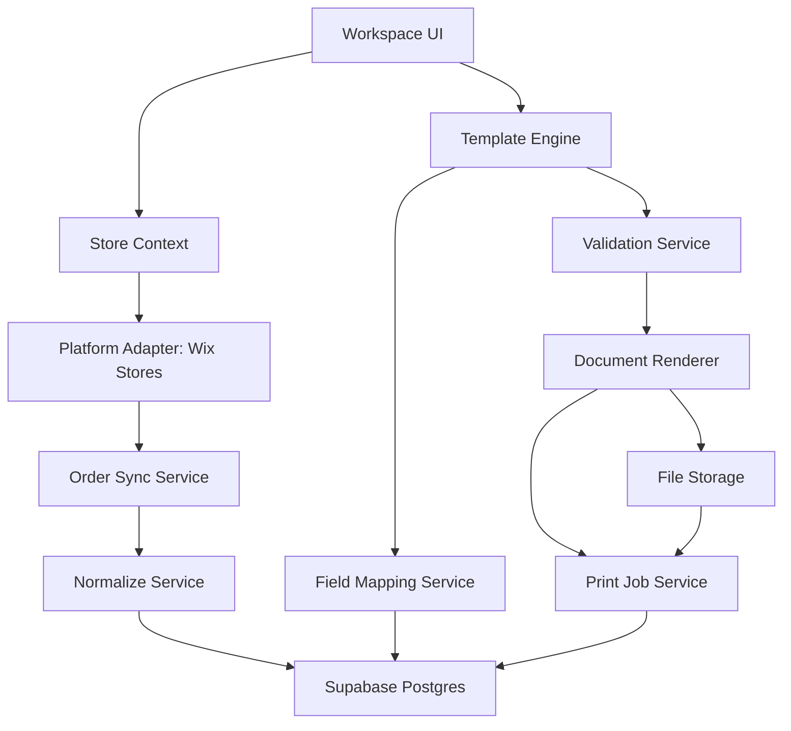
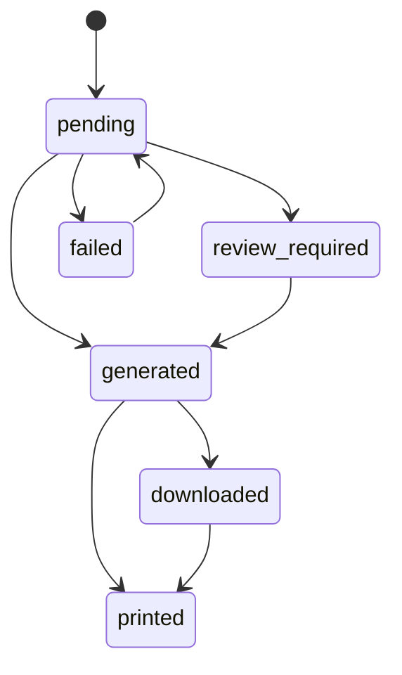
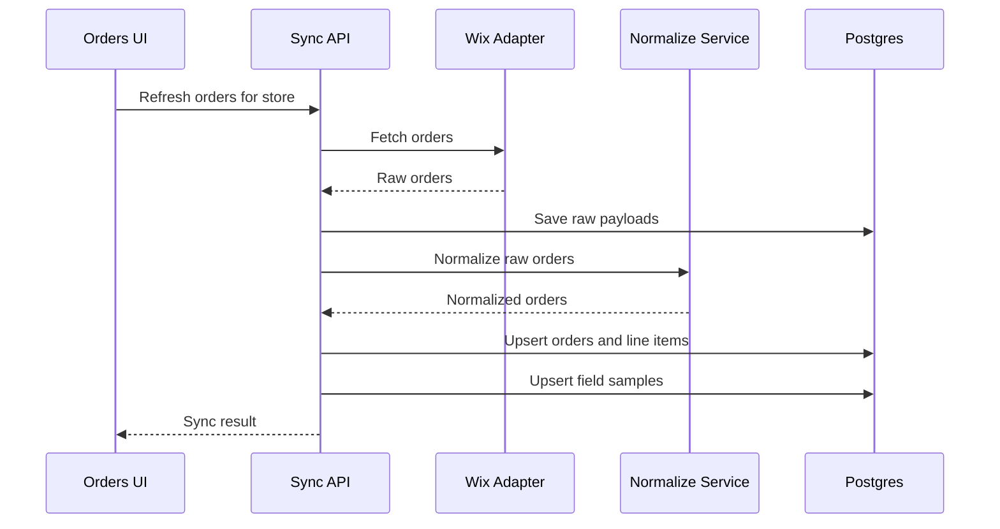
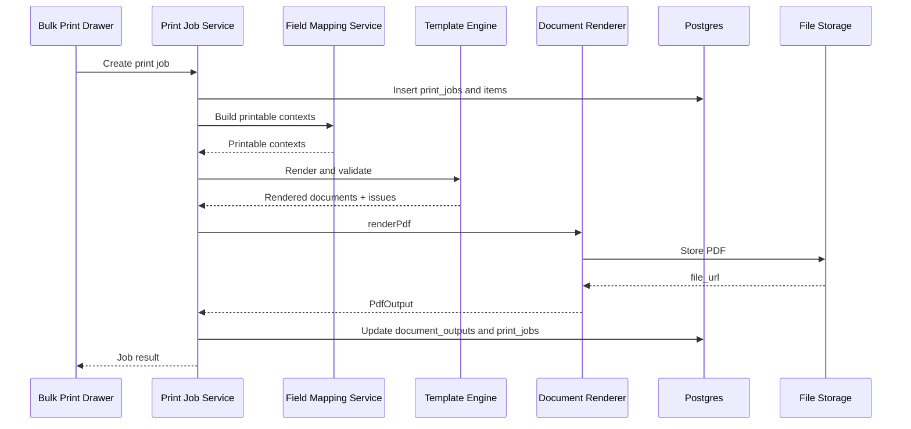

# Zider PrintOps 技术架构文档

版本：v0.4
更新日期：2026-05-30
文档类型：技术架构与实现方案
当前范围：Wix Stores P0，覆盖 Orders、Templates、Fields、Preview、PDF / Browser Print、Print History

## 1. 技术目标

订单打印系统需要先服务 Wix Stores，但核心能力不能写成 Wix-only。P0 技术目标：

- 支持一个组织连接多个 Wix 店铺。
- 从平台同步订单，P0 默认同步最新订单并允许手动回溯最近 7 天历史订单，保存原始 payload，并转换为标准订单模型。
- 支持字段映射，把 Wix checkout extra fields / custom fields 映射到标准字段或模板字段，并在 P0 模板、PDF 和浏览器打印中输出。
- 使用结构化模板 JSON 生成预览、浏览器打印和 PDF。
- 模板采用分层结构：`base template` + `template params` + `component tree` + 可选高级代码层，P0 先实现参数化配置。
- 模板底层从 P0 开始保持 AI-ready：AI 后续只能生成受控 schema 内的设计 token、参数、组件树和字段绑定建议。
- 记录每次生成、下载、浏览器打印和标记打印的 print job。
- 区分站点多语言和打印模板多语言：后台 UI 语言不直接决定打印输出语言。
- 模板渲染统一通过 `Template Render Context` 和 `Field Registry`，不直接读取平台原始 payload。
- P0 不连接打印机，不做云打印，不做发货回写，不做合规电子发票。

## 2. 推荐技术栈

基于当前仓库结构，优先沿用现有技术栈：

| 层 | 技术 |
|---|---|
| App Framework | Next.js App Router |
| UI | React、TypeScript |
| Validation | Zod |
| Database | Supabase Postgres |
| Server APIs | Next.js Route Handlers / Server Actions |
| Auth / Platform Context | Wix instance / app installation context + Zider organization context |
| Storage | Supabase Storage 或兼容对象存储，用于 PDF 文件 |
| PDF Rendering | 抽象成 renderer provider，P0 可先 browser print + server PDF spike |

说明：

- 技术文档先定义边界和接口，不强绑定某个 PDF 库。
- PDF 生成必须通过 `DocumentRenderer` 抽象，避免后续替换 Playwright、Chromium、React PDF 或第三方服务时影响模板系统。
- Wix API 能力需要独立 spike 验证，尤其是 checkout extra fields、uploaded files、pickup / delivery、POS / custom order 字段。

## 3. 总体架构



核心规则：

- UI 永远在当前 `organization_id + store_id` 上下文中工作。
- 平台适配层只负责授权、同步和原始数据读取。
- 模板、字段映射、预览、PDF、Print History 不直接读取 Wix 原始字段。
- 所有可打印字段必须来自标准订单模型、字段映射结果、自定义字段注册结果或产品打印字段。

代码目录约定：

```text
packages/platform-plugins/
├── wix/
│   └── src/
│       ├── config.ts
│       ├── orders.ts
│       ├── normalize.ts
│       ├── sync.ts
│       ├── types.ts
│       └── index.ts
├── wordpress/
└── shopify/
```

P0 先开发 `wix` adapter。`wordpress` 和 `shopify` 先保留目录和边界说明，后续分别接入 WooCommerce order meta / checkout fields 与 Shopify metafields / fulfillment。

## 4. 应用模块

### 4.1 Workspace UI

页面：

```text
/apps/printops                # 默认进入 Orders
/apps/printops/overview       # optional
/apps/printops/orders
/apps/printops/orders/:orderId
/apps/printops/templates
/apps/printops/templates/library
/apps/printops/templates/library/:libraryTemplateId
/apps/printops/templates/new
/apps/printops/templates/:templateId
/apps/printops/print-history
/apps/printops/settings
/apps/printops/settings/fields
```

P1 页面：

```text
/apps/printops/product-fields
/apps/printops/product-fields/:productId
/apps/printops/fields
/apps/printops/templates/shared
/apps/printops/templates/:templateId/rules
/apps/printops/templates/:templateId/versions
```

UI 规则：

- `Orders` 是默认入口。
- `Templates` 页面内部以 `Template Center` 组织，包含 My Templates 和 Template Library。
- `Print Jobs` 数据模型对外显示为 `Print History`。
- `Field Mapping` 对外显示为 `Fields`。
- P0 不暴露 `Printers`、`Shipments`、`Invoices`、`Order Types` 菜单。

### 4.2 Store Context

职责：

- 解析当前组织和当前店铺。
- 约束所有查询都带 `organization_id` 和 `store_id`。
- 切换店铺时清空批量选择状态。
- 给模板、字段、订单、print job 提供统一上下文。

关键对象：

```ts
type StoreContext = {
  organizationId: string;
  storeId: string;
  platform: "wix" | "woocommerce" | "shopify" | "csv" | "api";
  sourceStoreId: string;
  storeName: string;
  locale?: string;
  timezone?: string;
};
```

### 4.2.1 Localization Context

PrintOps 需要同时处理两种语言上下文：

```text
Site Locale
- 控制后台 UI、菜单、按钮、提示、设置页
- 与当前用户偏好或组织默认语言相关
- 不改变订单数据和打印文档内容

Print Locale
- 控制模板标题、字段 label、固定文案、PDF / 浏览器打印输出
- 可由模板默认语言、订单语言、客户语言或用户本次打印选择决定
- 必须写入 print job，保证历史输出可追溯
```

核心规则：

- `site_locale` 和 `print_locale` 分开存储。
- 站点语言切换只影响 Workspace UI。
- 打印语言切换必须传入 Template Engine 和 Document Renderer。
- 模板文案使用 localized text map 保存，例如 `{ default, en, zh-Hant, de, fr }`。
- 字段 label 先从模板配置读取；没有配置时回退到 Field Registry 的多语言 label。
- 字段值本身不自动翻译，除非后续显式启用翻译能力。
- RTL 语言前期只保留 schema 和渲染方向字段，P1 再验证真实语言包和 PDF。

建议类型：

```ts
type SiteLocale = "en" | "zh-Hant";

type PrintLocale = "en" | "zh-Hant" | "de" | "nl" | "fr" | "es";

type LocalizedText = {
  default: string;
} & Partial<Record<PrintLocale, string>>;

type LocalizationContext = {
  siteLocale: SiteLocale;
  printLocale: PrintLocale;
  fallbackPrintLocale: PrintLocale;
  direction: "ltr" | "rtl";
};
```

### 4.3 Platform Adapter

P0 只实现 Wix Stores Adapter。

适配层职责：

- 创建或读取 Wix access token。
- 同步 Wix 订单列表和订单详情。
- 保存平台原始 payload。
- 生成字段样本。
- 将平台订单转换为标准订单输入。
- 处理同步错误和重试。

适配层不得：

- 直接渲染模板。
- 直接生成 PDF。
- 直接决定文档样式。
- 让模板读取 Wix 原始 payload。

适配器接口：

```ts
type PlatformAdapter = {
  platform: SourcePlatform;
  syncOrders(input: SyncOrdersInput): Promise<SyncOrdersResult>;
  fetchOrder(input: FetchOrderInput): Promise<RawPlatformOrder>;
  normalizeOrder(input: RawPlatformOrder): Promise<NormalizedOrderDraft>;
  discoverFields(input: FieldDiscoveryInput): Promise<FieldDiscoveryResult>;
};
```

P1 增加：

- Wix Products Adapter。
- Webhook 增量同步。
- Product / variant 字段同步。

### 4.3.1 Platform Plugin Directory

平台接入代码统一放在共享插件目录，避免散落到页面、模板中心或某个单独平台应用里：

```text
packages/platform-plugins/
  wix/
    src/
      config.ts
      orders.ts
      normalize.ts
      types.ts
      index.ts
  shopify/
    README.md
  wordpress/
    README.md
```

目录规则：

- `wix` 是 P0 首发插件，应用名为 `Zider PrintOps`，app key 为 `zider_printops`。
- `shopify` 和 `wordpress` 先保留目录，不进入 P0 生产开发。
- 平台插件只做授权、同步、原始数据读取、标准化和字段发现。
- 模板中心、PDF 渲染、浏览器打印和 Print History 不直接依赖某个平台 SDK。

Wix P0 同步策略：

| 同步模式 | 范围 | 说明 |
|---|---|---|
| `latest` | `lastSyncedAt` 之后；首次默认回看 24 小时 | 用于日常刷新最新订单 |
| `history` | 最近 1-7 天 | 用于安装后或测试时手动补最近订单 |

约束：

- P0 不做任意历史全量同步，超过 7 天的历史窗口直接拒绝。
- 每次同步必须保存 raw payload，再执行字段标准化。
- 自定义字段需要从订单级和订单行级同时抽取，并保留原始路径。
- Webhook 增量、同步任务队列、长历史分页恢复和 fulfillment 回写放到 P1/P3。

## 5. 数据模型

### 5.1 多租户基础表

```text
organizations
stores
store_locations
store_platform_connections
```

建议字段：

```text
organizations
- id
- name
- owner_user_id
- default_locale
- created_at
- updated_at

stores
- id
- organization_id
- platform
- source_store_id
- name
- url
- locale
- timezone
- status
- connected_at
- last_synced_at
- created_at
- updated_at

store_platform_connections
- id
- organization_id
- store_id
- platform
- source_instance_id
- access_token_ref
- refresh_token_ref
- scopes
- status
- last_auth_at
- created_at
- updated_at
```

说明：

- 现有 `app_installations` / `app_platform_secrets` 可作为 Wix app 安装和凭证基础。
- 订单打印的业务 store 表应和平台安装表解耦，避免未来 WooCommerce / Shopify 接入时被 Wix instance 概念锁死。

### 5.2 订单表

```text
orders
order_line_items
order_custom_fields
order_raw_payloads
order_sync_events
```

建议字段：

```text
orders
- id
- organization_id
- store_id
- source_platform
- source_store_id
- source_order_id
- display_order_number
- order_date
- source_updated_at
- synced_at
- currency
- customer_name
- customer_email
- customer_phone
- customer_company
- customer_tax_id
- customer_locale
- shipping_address jsonb
- billing_address jsonb
- pickup_location jsonb
- delivery_address jsonb
- fulfillment jsonb
- payment jsonb
- tags text[]
- purchase_order_number
- print_status
- last_printed_at
- created_at
- updated_at
```

```text
order_line_items
- id
- organization_id
- store_id
- order_id
- source_line_item_id
- source_product_id
- source_variant_id
- title
- sku
- variant_title
- quantity
- price
- discount
- tax
- image_url
- options jsonb
- custom_fields jsonb
- product_print_fields_snapshot jsonb
- created_at
- updated_at
```

```text
order_raw_payloads
- id
- organization_id
- store_id
- order_id
- source_platform
- source_order_id
- payload jsonb
- payload_hash
- received_at
```

规则：

- `order_raw_payloads` 只给同步、debug 和字段发现使用。
- 模板渲染不直接读取 `payload`。
- `product_print_fields_snapshot` 保存打印时合并结果，便于重印复现。

### 5.3 字段映射表

```text
field_sources
field_mappings
field_samples
field_registry_entries
```

建议字段：

```text
field_sources
- id
- organization_id
- store_id
- source_platform
- source_key
- source_path
- scope
- inferred_type
- sample_values jsonb
- first_seen_at
- last_seen_at
```

```text
field_mappings
- id
- organization_id
- store_id
- source_field_id
- target_scope
- target_key
- display_label
- value_type
- transform_type
- fallback_value
- is_enabled
- created_at
- updated_at
```

字段 scope：

```text
order
customer
address
line_item
product
variant
fulfillment
payment
store
computed
template
```

### 5.3.1 Field Registry

`Field Registry` 是模板编辑器和 Template Engine 的字段目录，负责把标准字段、平台字段、产品打印字段、计算字段统一暴露给模板组件。

建议字段：

```text
field_registry_entries
- id
- organization_id
- store_id null
- key                         # customer.tax_id | lineItems.customFields.production_note
- label jsonb                 # LocalizedText
- scope                       # store | order | customer | address | line_item | payment | fulfillment | shipment | custom | computed | template
- value_type                  # text | number | money | date | datetime | url | image | file | boolean | enum | json | array
- source                      # standard | wix | woocommerce | shopify | csv | api | product_print_field | computed | template
- printable
- required
- nullable
- sample_value jsonb
- fallback jsonb              # LocalizedText
- privacy                     # public | business | customer_personal | sensitive
- created_at
- updated_at
```

规则：

- 模板组件只能绑定 Field Registry 中 `printable = true` 的字段，或绑定明确允许的 computed 字段。
- Field Registry 需要支持多语言 label，供站点 UI 和打印模板 label fallback 使用。
- Field Registry 不保存平台原始 payload，只保存字段路径、样本值和元信息。
- 隐私字段需要在 AI Template Designer、模板预览和调试日志中做额外提示或脱敏。

### 5.4 模板表

```text
template_library_items
templates
template_defaults
template_versions
template_rules
```

建议字段：

```text
templates
- id
- organization_id
- store_id null
- source_template_id null
- base_template_key null
- name
- description
- document_type
- template_family           # visual family, e.g. leopard | wolf | minimal | thermal
- category                 # fulfillment | production | customer_documents | store_pos | b2b
- scenario_tags            # shipping | pickup | delivery | pos | custom | b2b
- scope                    # store | organization | built_in
- customization_level       # preset | parameterized | component | code
- paper_size               # A4 | Letter | 4x6 | 80mm
- default_language
- default_font
- status                   # draft | ready | inactive
- thumbnail_url
- validation_status        # ok | warning | error
- validation_summary jsonb
- schema_version
- design_tokens jsonb
- template_params jsonb
- component_tree jsonb
- advanced_code jsonb null
- template_json jsonb
- created_by
- created_at
- updated_at
```

```text
template_defaults
- id
- organization_id
- store_id
- document_type
- template_id
- created_at
- updated_at
```

`template_json` 示例：

```json
{
  "schemaVersion": "1.0",
  "baseTemplateKey": "leopard.invoice.a4",
  "customizationLevel": "parameterized",
  "documentType": "packing_slip",
  "paper": {
    "size": "A4",
    "margin": "12mm"
  },
  "designTokens": {
    "primaryColor": "#111111",
    "accentColor": "#0f766e",
    "fontFamily": "Inter",
    "density": "comfortable"
  },
  "templateParams": {
    "logoPlacement": "header_left",
    "showPrices": true,
    "showProductImages": true,
    "footerMessage": {
      "default": "Thank you for your order."
    }
  },
  "sections": [
    {
      "id": "header",
      "type": "section",
      "children": [
        {
          "id": "store-logo",
          "type": "media",
          "binding": "store.logo"
        },
        {
          "id": "order-number",
          "type": "field",
          "binding": "order.display_order_number",
          "label": "Order"
        }
      ]
    }
  ]
}
```

规则：

- P0 可以用表单式编辑器，但保存结构必须是参数化模板 JSON 和组件 JSON。
- 内置模板是 `base template`，店铺模板保存参数覆盖和组件覆盖，不直接修改内置模板。
- `customization_level = parameterized` 是 P0 默认能力；`component`、`code` 为后续能力。
- 禁止保存任意 HTML 作为唯一模板来源。
- 高级代码模板或 Liquid-like 语法只能作为 P2 能力。
- 进入代码模式前必须创建模板版本快照，代码模板不能破坏已有参数化编辑链路。
- P0 默认模板使用 `template_defaults` 表维护，避免在多个模板行上写竞争状态。
- 内置模板更新不自动覆盖已经复制出来的店铺模板。
- `status = draft` 的模板可以保存和预览，但不能设置为默认模板。

### 5.5 Print Job 表

```text
print_jobs
print_job_items
document_outputs
```

建议字段：

```text
print_jobs
- id
- organization_id
- store_id
- source_platform
- document_type
- template_id
- template_version_id
- print_language
- paper_size
- output_type              # pdf | browser_print | zip
- status                   # pending | generated | downloaded | printed | failed | review_required
- file_url
- file_name
- created_by
- created_at
- updated_at
- error_message
```

```text
print_job_items
- id
- organization_id
- store_id
- print_job_id
- order_id
- status
- validation_warnings jsonb
- document_output_id null
```

```text
document_outputs
- id
- organization_id
- store_id
- print_job_id
- order_id null
- template_id
- document_type
- output_type
- file_url
- file_name
- content_hash
- generated_at
```

## 6. 核心服务

### 6.1 Order Sync Service

职责：

- 拉取订单列表。
- 拉取订单详情。
- 保存 raw payload。
- 调用 Normalize Service。
- 更新订单和订单行。
- 发现字段样本。
- 记录同步事件。

同步策略：

- P0 支持手动同步和手动刷新单个订单。
- P1 增加 webhook / 增量同步。
- 同步写入需要幂等，使用 `store_id + source_platform + source_order_id` 去重。

### 6.2 Normalize Service

职责：

- 将 Wix 原始订单转换为标准订单模型。
- 将订单行、地址、客户、支付、履约、备注转换为统一字段。
- 保留无法标准化的字段到 `order_custom_fields`、`line_item.custom_fields` 或 field samples。
- P0 必须抽取 Wix checkout extra fields、order custom fields、buyer note、gift note，以及订单行上随订单传递的 custom text / options 字段，供模板打印。

接口：

```ts
type NormalizeOrderResult = {
  order: NormalizedOrder;
  lineItems: NormalizedLineItem[];
  customFields: NormalizedCustomField[];
  rawFieldSamples: FieldSample[];
};
```

### 6.3 Field Mapping Service

职责：

- 展示字段来源和样本值。
- 保存 source field 到 target field 的映射。
- 在渲染前生成 `Template Render Context`。
- 提供字段缺失和字段类型 warning。
- 为 P0 模板提供可打印的订单级和订单行级自定义字段，支持 label、排序、隐藏空值和必填校验。

渲染前输出：

```ts
type TemplateRenderContext = {
  locale: PrintLocale;
  store: TemplateStoreContext;
  order: TemplateOrderContext;
  customer: TemplateCustomerContext;
  addresses: TemplateAddressContext;
  lineItems: TemplateLineItemContext[];
  payment: TemplatePaymentContext;
  fulfillment: TemplateFulfillmentContext;
  shipments?: TemplateShipmentContext[];
  customFields: Record<string, PrintableValue>;
  computed: TemplateComputedContext;
  template: TemplateRuntimeSettings;
};
```

### 6.3.1 Template Render Context Builder

职责：

- 读取标准订单模型、订单行、自定义字段、产品打印字段、店铺品牌设置和模板设置。
- 按本次 `print_locale` 选择模板文案和字段 label fallback。
- 合并 Field Registry 元信息，生成组件可读取的数据上下文。
- 计算 computed 字段，如礼品订单、B2B 订单、定制商品、商品总数量、缺失字段和隐藏价格策略。
- 生成预览样本数据，供没有真实订单时的模板编辑器使用。

输入：

```ts
type BuildTemplateRenderContextInput = {
  organizationId: string;
  storeId: string;
  orderId?: string;
  templateId: string;
  printLocale: PrintLocale;
  previewMode: "sample" | "order";
};
```

输出：

```ts
type BuildTemplateRenderContextResult = {
  context: TemplateRenderContext;
  fieldRegistry: FieldRegistryItem[];
  warnings: ValidationWarning[];
};
```

### 6.3.2 Template Customization Service

职责：

- 从内置 `base template` 创建店铺模板。
- 保存模板参数覆盖，如品牌、字体、纸张、密度、字段开关和固定文案。
- 保存组件覆盖，如 section 排序、block 显示、字段 label、商品表格列。
- 合并 `base template + template_params + component_tree`，生成 Template Engine 可编译的完整模板。
- 管理 `customization_level`，让 P0 参数化模板后续可以升级到组件编辑或代码模式。
- 在内置模板升级时提示商家是否合并新版本，不自动覆盖商家改动。
- 支持未来 AI 生成模板草稿的同构写入：AI 输出也必须落到 template params、component overrides 和 field bindings。

核心对象：

```ts
type TemplateCustomizationLevel = "preset" | "parameterized" | "component" | "code";

type TemplateParams = {
  brand: {
    logoAssetId?: string;
    primaryColor?: string;
    accentColor?: string;
    fontFamily?: string;
  };
  document: {
    paperSize: "A4" | "Letter" | "4x6" | "80mm";
    orientation: "portrait" | "landscape";
    marginPreset: "normal" | "compact" | "narrow";
    density: "comfortable" | "compact";
  };
  content: {
    showPrices: boolean;
    showProductImages: boolean;
    showBuyerNote: boolean;
    footerMessage?: LocalizedText;
  };
};

type ComponentOverride = {
  componentId: string;
  visible?: boolean;
  order?: number;
  label?: LocalizedText;
  style?: Record<string, unknown>;
  fieldBinding?: string;
};

type BuildTemplateFromBaseInput = {
  baseTemplateKey: string;
  templateParams: TemplateParams;
  componentOverrides: ComponentOverride[];
};
```

代码模式规则：

- 代码模式只能从已有结构化模板创建，不允许空白写入生产 HTML。
- 进入代码模式时写入 `template_versions` 快照。
- 代码模式输出仍需通过 Validation Service，校验字段绑定、分页、字体、图片和安全规则。
- 从代码模式回到组件模式时，如果无法自动转换，保留上一个组件版本作为回退。

AI-ready 规则：

- AI 生成不能直接保存为不可编辑图片、任意 HTML 或任意 CSS。
- AI 输出必须符合模板 JSON schema，并写入 `design_tokens`、`template_params`、`component_tree` 或 `component_overrides`。
- AI 字段绑定必须引用 Field Registry 中 `printable = true` 的字段。
- AI 草稿必须经过 Template Engine compile 和 Validation Service 校验。
- AI 草稿默认 `status = draft`，不能自动设为默认模板。
- AI 处理客户信息、地址、电话、邮箱、税号和上传文件时，需要依赖 Field Registry 隐私标记做提示或脱敏。

未来 AI 输出对象：

```ts
type AITemplateDraft = {
  source: "ai";
  prompt?: string;
  inputAssetIds: string[];
  designTokens: TemplateDesignTokens;
  templateParams: TemplateParams;
  componentTree: TemplateComponentNode[];
  fieldBindingSuggestions: ComponentFieldBindingSuggestion[];
  localizedTextSuggestions: Record<string, LocalizedText>;
  validationSummary: ValidationIssue[];
};
```

### 6.4 Template Engine

职责：

- 读取模板 JSON。
- 解析组件树。
- 根据 `Template Render Context` 和 Field Registry 绑定字段。
- 应用语言、字体、纸张和样式。
- 输出渲染中间结果。

接口：

```ts
type TemplateEngine = {
  compile(template: TemplateRecord): CompiledTemplate;
  render(input: RenderTemplateInput): RenderedDocument;
  validate(input: RenderTemplateInput): ValidationResult;
};
```

### 6.5 Validation Service

校验项：

- 必填字段缺失。
- 图片无法访问。
- 上传文件不是可预览类型。
- 字段类型不匹配。
- 文本过长可能溢出。
- 语言文案缺失。
- 字体可能缺字。
- 订单数据过旧。

输出：

```ts
type ValidationIssue = {
  severity: "info" | "warning" | "error";
  code: string;
  message: string;
  orderId?: string;
  componentId?: string;
  fieldKey?: string;
};
```

P0 规则：

- `error` 阻止批量生成 PDF。
- `warning` 允许继续，但需要在 Bulk Print Drawer 展示。
- 每个 print job item 保存当时的 validation warnings。

### 6.6 Document Renderer

职责：

- 将 `RenderedDocument` 转成 HTML preview。
- 将同一份渲染结果用于 browser print。
- 将同一份渲染结果用于 PDF provider。
- 控制纸张尺寸、分页、字体和图片加载。

接口：

```ts
type DocumentRenderer = {
  renderPreview(input: RenderedDocument): Promise<PreviewOutput>;
  renderPrintHtml(input: RenderedDocument): Promise<PrintHtmlOutput>;
  renderPdf(input: RenderedDocument | RenderedDocument[]): Promise<PdfOutput>;
};
```

P0 实现建议：

- UI 预览使用 HTML + print CSS。
- Browser print 使用同一份 print HTML。
- PDF 生成通过 `PdfProvider` 抽象，先做技术 spike。
- PDF 文件存入对象存储，并把 file URL 写回 `document_outputs` 和 `print_jobs`。

### 6.7 Print Job Service

职责：

- 创建 print job。
- 记录订单和模板快照。
- 触发渲染和 PDF 生成。
- 保存输出文件。
- 更新状态。
- 支持失败重试。
- 支持 mark as printed。

状态流：



## 7. 关键流程

### 7.1 手动同步订单



### 7.2 批量生成 PDF



### 7.3 浏览器打印

```text
Bulk Print Drawer
↓
Create print job with output_type=browser_print
↓
Build printable contexts
↓
Render print HTML
↓
Open print view / iframe
↓
Browser print
↓
User marks as printed or system records print dialog opened
```

说明：

- 浏览器无法可靠确认实体打印成功。
- P0 记录 `browser_print_opened` 或 `printed` 由用户确认。
- 后续设备打印再处理真实打印机状态。

## 8. API 设计

P0 Route Handlers 建议：

```text
GET    /api/apps/printops/stores
POST   /api/apps/printops/stores/:storeId/sync-orders
GET    /api/apps/printops/stores/:storeId/orders
GET    /api/apps/printops/stores/:storeId/orders/:orderId

GET    /api/apps/printops/stores/:storeId/template-library
GET    /api/apps/printops/stores/:storeId/template-library/:libraryTemplateId
GET    /api/apps/printops/stores/:storeId/templates
POST   /api/apps/printops/stores/:storeId/templates
POST   /api/apps/printops/stores/:storeId/templates/from-library
GET    /api/apps/printops/stores/:storeId/templates/:templateId
PATCH  /api/apps/printops/stores/:storeId/templates/:templateId
DELETE /api/apps/printops/stores/:storeId/templates/:templateId
POST   /api/apps/printops/stores/:storeId/templates/:templateId/duplicate
POST   /api/apps/printops/stores/:storeId/templates/:templateId/set-default
POST   /api/apps/printops/stores/:storeId/templates/:templateId/preview

GET    /api/apps/printops/stores/:storeId/fields
POST   /api/apps/printops/stores/:storeId/field-mappings
PATCH  /api/apps/printops/stores/:storeId/field-mappings/:mappingId

GET    /api/apps/printops/stores/:storeId/print-history
POST   /api/apps/printops/stores/:storeId/print-jobs
POST   /api/apps/printops/stores/:storeId/print-jobs/:jobId/retry
POST   /api/apps/printops/stores/:storeId/print-jobs/:jobId/mark-printed
```

P1：

```text
POST   /api/apps/printops/stores/:storeId/sync-products
GET    /api/apps/printops/stores/:storeId/product-fields
GET    /api/apps/printops/stores/:storeId/product-fields/:productId
PATCH  /api/apps/printops/stores/:storeId/product-fields/:productId
PATCH  /api/apps/printops/stores/:storeId/product-fields/:productId/variants/:variantId
```

API 规则：

- 所有 API 必须校验 `organization_id + store_id` 权限。
- 不接受前端传入的 organization_id 作为唯一可信来源。
- storeId 必须属于当前用户可访问组织。
- 所有写操作使用 Zod schema 校验。

## 9. 安全与权限

### 9.1 多店铺隔离

所有核心表必须包含：

```text
organization_id
store_id
```

例外：

- `organizations` 不需要 store_id。
- `template_library_items` 作为系统内置模板，可以没有 store_id。
- `app_platform_secrets` 按 app/platform 管理凭证，不直接作为业务订单表。

### 9.2 原始数据安全

订单 raw payload 可能包含：

- 客户姓名、邮箱、电话。
- 地址。
- 支付相关摘要。
- 上传文件链接。
- 备注和自定义字段。

规则：

- raw payload 只服务同步、debug、字段发现。
- UI 默认不暴露完整 raw payload。
- 日志不得打印完整订单 payload。
- PDF 文件 URL 需要有过期或权限控制。

### 9.3 模板安全

P0 禁止：

- 任意 HTML。
- 任意 CSS。
- 任意 JavaScript。
- 远程脚本。

允许：

- 受控组件。
- 受控样式 schema。
- 受控字段绑定。
- 受控图片 URL 渲染。

## 10. 文件与目录建议

实际结构应跟随仓库落点，这里给出建议：

```text
src/
  order-printing/
    core/
      types.ts
      normalized-order.ts
      printable-context.ts
    adapters/
      wix-stores-adapter.ts
      wix-products-adapter.ts
    fields/
      field-discovery.ts
      field-mapping-service.ts
      transforms.ts
    templates/
      template-schema.ts
      template-engine.ts
      built-in-templates.ts
      template-validation.ts
    rendering/
      document-renderer.ts
      html-renderer.ts
      pdf-provider.ts
      print-css.ts
    print-jobs/
      print-job-service.ts
      print-job-status.ts
    sync/
      order-sync-service.ts
      product-sync-service.ts
    storage/
      document-storage.ts
    api/
      schemas.ts
```

Next.js 页面建议：

```text
src/app/apps/printops/
  page.tsx
  orders/page.tsx
  orders/[orderId]/page.tsx
  templates/page.tsx
  templates/library/page.tsx
  templates/[templateId]/page.tsx
  print-history/page.tsx
  settings/page.tsx
```

## 11. P0 技术里程碑

### Milestone 1：数据模型和 Store Context

交付：

- organization / store / connection 表设计。
- orders / order_line_items / raw_payloads 表设计。
- templates / field_mappings / print_jobs 表设计。
- Store Context 查询和权限校验。

验收：

- 所有订单打印查询都按 `organization_id + store_id` 过滤。
- 切换 store 后 Orders、Templates、Print History 数据隔离。

### Milestone 2：Wix Orders Adapter

交付：

- Wix 店铺连接上下文。
- 手动同步订单。
- raw payload 保存。
- 标准订单转换。
- 字段样本发现。

验收：

- 能同步测试 Wix 店铺订单。
- 能保存订单原始 payload。
- 能在 Orders 页面看到标准化订单。
- 能发现 custom fields 样本，并保存订单级和订单行级自定义字段。

### Milestone 3：Templates and Fields

交付：

- 内置模板库。
- My Templates。
- 模板 JSON schema。
- Base template + template params + component tree 数据结构。
- 从内置风格模板创建店铺模板。
- 字段开关、字段 label、商品表格列配置。
- Fields 映射。

验收：

- 能从 Template Library 创建模板。
- 能基于一个内置风格模板修改品牌、纸张、字段和文案参数。
- 能绑定标准字段和 custom fields。
- 能把订单级 custom fields 和订单行 custom fields 加入模板，并在预览中看到真实样本值。
- 模板保存为结构化 JSON，而不是纯 HTML。

### Milestone 4：Preview and Validation

交付：

- PrintableOrderContext。
- Template Engine。
- Preview HTML。
- Validation issues。

验收：

- 能选择真实订单预览模板。
- 自定义字段在预览、PDF 和浏览器打印中输出一致。
- 能显示缺字段、图片失败、文本溢出 warning。
- 预览和后续 PDF 使用同一模板结构。

### Milestone 5：PDF / Browser Print / Print History

交付：

- Browser print view。
- Print job 创建。
- PDF renderer provider spike。
- document_outputs 存储。
- Print History 页面。

验收：

- 批量选择订单后能生成 print job。
- 能生成 combined PDF 或至少完成 PDF provider spike。
- 能浏览器打印。
- Print History 能展示状态、文件名、下载入口和错误。

## 12. P1 技术预留

P1 方向：

- Wix Products Adapter。
- Product Fields 页面。
- 产品 / 变体打印字段。
- 产品字段与订单行合并。
- Template versions。
- Template matching rules。
- Fields 独立页面。
- 批量 ZIP 下载。
- 自定义文件名规则。

P1 不做：

- 把产品打印字段写回 Wix 商品资料。
- 替代 Wix 产品管理。
- 打印机设备连接。
- 发货回写。

## 13. 技术风险与 Spike

### 13.1 Wix Orders 字段覆盖

风险：

Wix Orders API 对 checkout extra fields、uploaded files、pickup / local delivery、POS / custom order 字段覆盖可能不完整。

Spike：

- 创建测试 Wix 店铺。
- 创建包含 custom fields、uploaded files、pickup、delivery、POS / custom order 的订单。
- 对比 Dashboard 看到的数据和 API 返回数据。
- 记录可稳定读取的字段路径。

### 13.2 PDF 生成

风险：

服务器 PDF 生成可能受部署环境、字体、Chromium 体积和超时影响。

Spike：

- 用 10、50、100 个订单测试 PDF 生成时间和文件大小。
- 测试 A4、Letter、4x6、80mm。
- 测试 CJK 字体嵌入。
- 测试图片加载失败时的 fallback。

### 13.3 Browser Print 状态

风险：

浏览器无法确认用户是否真的完成实体打印。

策略：

- P0 记录 print view opened。
- 让用户手动 Mark as printed。
- 后续设备打印再引入真实打印机状态。

### 13.4 模板迁移

风险：

P0 表单式模板如果保存为 HTML 或散落字段，后续组件编辑器、拖拽编辑器和代码模式会很难迁移。

策略：

- 从第一版开始保存组件 JSON。
- 从第一版开始保存 `base_template_key`、`template_params` 和 `component_tree`。
- 所有模板带 `schema_version`。
- 所有 renderer 从组件 JSON 生成输出。
- 高级代码模式必须从结构化模板派生，并保留可回退版本。

## 14. 待确认问题

- Wix Orders API 是否稳定返回 checkout extra fields？
- Wix Orders API 是否稳定返回 uploaded file URL？
- Wix pickup / local delivery 字段路径是什么？
- Wix POS / custom order 是否能通过同一订单 API 获取？
- Wix App Dashboard 中 Orders 页面入口是否能自然跳转到我们的 Orders？
- PDF provider 使用自建 Chromium、第三方服务，还是先 browser print + later PDF？
- PDF 文件保留多久？
- Print History 是否需要按用户权限隐藏客户 PII？
- 多店铺模板复制时，字段映射缺失如何提示？
